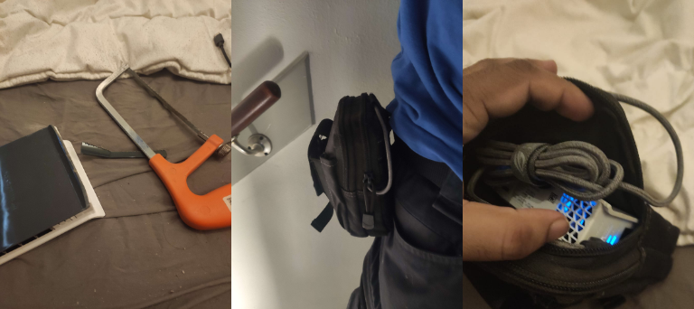

# hAP AX Lite LTE6 - Wireguard Roadwarrior

Since I work as a truck driver, I'm on the road quite a lot.  
However, breaks are a *huge* pain for me.
As a result, I bought a little [hAP AX Lite LTE6](https://mikrotik.com/product/hap_ax_lite_lte6) (herafter "router") so I can have portable wifi with me, without relying on my phone's wifi hotspot.  
Together with a little `Unlimited Data` plan (FUP applies) from Dutch telecom provider `Odido`, I basically don't have to worry about data either.  
And with the power of a hacksaw, I made it all fit inside a little pouch (although I would later end up using a slightly different pouch - which still would have needed hacksawing), together with a powerbank.  
In my opinion, this makes it a *true* road warrior.



I use Wireguard quite a bit when on the road to connect to my servers but what if I get a new device and forget to setup a client?  
Well, I'm kinda screwed then...  
But what if I am one step ahead of myself and just have the router handle it for me?  
That's probably save me a lot of headaches in the future.

An additional feature is that you can use _either_ the LTE connection _or_ `ether1` as your uplink without affecting the tunnel (at most there'll be a temporary disconnect when swapping over).  
This makes it a good companion on holidays too!  
Sadly, the router only has a single `2.4GHz` WiFi connection, so it can't easily be used to relay a WiFi connection while you use (for example) the `5GHz` connection yourself.  
Something like a [Chateau LTE6](https://mikrotik.com/product/chateau_lte6) would be your friend here, but this was too big for my goals and didn't allow powering via USB.
 
**NOTE**: This setup only handles the side of the router as a "client".  
I assume you've already setup a server on your own.

**NOTE**: This setup uses Wireguard *but* should in theory also work just fine for IPsec or OpenVPN.  
You'll just need to substitute the Wireguard interface for your IPsec/OpenVPN interface.

## Setup Wireguard

First, we need to setup Wireguard itself.  
This can be done in the usual by adding a wireguard interface and a peer.  
Of course, you'll need to replace the "REDACTED" bits with your own information.  
This is just basic MikroTik Wireguard stuff and other than that has very little impact on the setup.  
Only the interface name is important for later.
```
/interface wireguard
  add listen-port=13231 mtu=1420 name=wireguard1
  
/interface wireguard peers
  add allowed-address=0.0.0.0/0 client-address=REDACTED client-dns=REDACTED client-listen-port=13231 endpoint-address=REDACTED endpoint-port=13231 interface=wireguard1 name=home persistent-keepalive=5s public-key=\
    "REDACTED"  
  
/ip address    
  add address=REDACTED interface=wireguard1 network=REDACTED  
```

Now we need to create a routing table for the VPN.  
This is just a "collection of routes" but on its own it doesn't quite do anything yet.
```
/ip vrf
  add interfaces=none name=VPN
```

And let's create a routing rule that will send all the traffic marked with the `VPN` mark, into the routing table we've just created.  
By specifying the `action=lookup-only-in-table` we tell the router to... well... Only look for routes in the *specific* table we've specified.  
In other words, if our VPN table doesn't have a suitable route, it will simply not be routed and no fallback to the `main` table will be made either.
```
/routing rule
  add action=lookup-only-in-table disabled=no routing-mark=VPN table=VPN
```

Next, we need to create a route to send anything coming into our routing table out via the Wireguard interface.
Without this, the router doesn't quite know where to send the traffic.  
Don't worry, we'll specify which data can and cannot be routed over the VPN in a bit.
```
/ip route
  add disabled=no distance=1 dst-address=0.0.0.0/0 gateway=wireguard1 pref-src="" routing-table=VPN scope=30 suppress-hw-offload=no target-scope=10
```

To make it easier on ourselves, we need to tell our firewall to masquerade any traffic going out via the wireguard interface.  
This will mean that all traffic seems to come from _one_ source as far as the server is concerned, significantly simplifying the server config as well.
```
/ip firewall nat
  add action=masquerade chain=srcnat out-interface=wireguard
```

Now let's define the IP ranges we want to have go via Wireguard.  
In my case, I only care about some ranges for my home network.
```
/ip firewall address-list
  add address=192.168.1.0/24 list="Home via VPN"
  add address=192.168.3.0/24 list="Home via VPN"
  add address=192.168.0.0/24 list="Home via VPN"
```

And finally, to make it all work, we need to mark routes to go over wireguard.
This will just look whether the destination address is in the list we just made and if so, mark the route.  
It will, however, exclude traffic going _directly_ to the router so I can still access it and its services.
```
/ip firewall mangle
  add action=mark-routing chain=prerouting comment="Home via VPN" dst-address=!192.168.88.1 dst-address-list="Home via VPN" new-routing-mark=VPN
```

And that's it!  
When you connect to the WiFi and try to reach any of the addresses in the `Home via VPN` list, it'll automatically send this over the Wireguard!  
In theory, you can create additional lists and mangle rules if you want to allow more stuff and keep it all organized!  
I have _not_ yet tested it with routing _everything_ over the wireguard but feel free to test this yourself.

## Sharing is caring!

Sometimes, you hang out with a friend... Hmm... Friends...  
Yes, let's just assume we have friends, okay?  
Anyways, they can also make use of this router _but_ you don't quite want them to access your home network.  
Well, then we can just setup a guest network for them but not mark the routes to go through the VPN.

First, we create a virtual interface under the main WiFi interface.
Don't forget to replace `MyGuestSSID` and `lamepassword123` with your own!
```
/interface wifi
  add configuration.mode=ap .ssid="MyGuestSSID" disabled=no master-interface=wifi1 name=wifi2 security.authentication-types=wpa2-psk,wpa3-psk security.passphrase="lamepassword123"
```

Next, we want to add the new virtual interface as a bridge port.  
Additionally, we want to all the traffic with the VLAN ID `2`.  
This is arbitrarily chosen and you can pick any ID more suitable to your needs.
``` 
/ip bridge port
  add bridge=bridge frame-types=admit-only-untagged-and-priority-tagged interface=wifi2 pvid=2
```

Next, we need to add the VLAN to our bridge filters and enable VLAN filtering on our bridge.  
This may temporarily cause connections to drop but it should pick up after a second or two.
``` 
/interface bridge vlan
  add bridge=bridge tagged=bridge untagged=wifi2 vlan-ids=2

/interface bridge
  set name=bridge vlan-filtering=yes
```

Setup a VLAN interface on our `bridge` so we can act as the gateway for this network.
Then we need to also give it an IP address.
I'll be using the `172.16.1.0/24` range for this VLAN but you can pick whatever you want.
```
/interface vlan
  add interface=bridge name=vlan2 vlan-id=2

/ip address
  add address=172.16.1.1/24 interface=vlan2 network=172.16.1.0
```

And setup the DHCP server on this VLAN:
```
/ip pool
  add name=guests ranges=172.16.1.2-172.16.1.254

/ip dhcp-server
  add address-pool=guests interface=vlan2 lease-time=10m name=guests
  
/ip dhcp-server network
  add address=172.16.1.0/24 comment=guests dns-server=172.16.1.1 gateway=172.16.1.1
```

Now you have a guest network that will _not_ be allowed to reach your Home network but still use your data plan.  

If you want to allow certain addresses to be routed via the VPN anyways, just add them to a new list and create the required mangle rule.

```
/ip firewall address-list
  add address=1.2.3.4 list="Guest via VPN"
  
/ip firewall mangle
  add action=mark-routing chain=prerouting comment="Guest via VPN" dst-address=!192.168.88.1 dst-address-list="Guest via VPN" new-routing-mark=VPN
```

### Password rotation

Because I tend to forget my wifi passwords a lot, I made a little script that just changes it for me in a way I at least remember.  
My choice for this is the current date `YYYYMMDD`.  
This makes it so I only need to remember what date it is in order to remember the password.
An additional benefit is that it allows me *some* control over who connects, especially if I hand the password to a colleague or something.

I've written the script so that it makes sure no clients are connected before changing the password.  
So as long as someone is connected, the password will remain the same.  
Useful for when I have night shifts that pass into a new day.
``` 
/system script
add dont-require-permissions=no name=change-guest-password owner=admin policy=read,write source="# Get amount of connected devices\
    \n:local deviceCount [/interface/wifi/registration-table print count-only where interface=\"wifi2\"];\
    \n\
    \n# Create the new password\
    \n:local datetime [/system clock get date];\
    \n:local day [ :pick \$datetime 8 11 ];\
    \n:local month [ :pick \$datetime 5 7 ];\
    \n:local year [ :pick \$datetime 0 4 ];\
    \n:local newPassword \"\$year\$month\$day\";\
    \n\
    \n# Get the current password\
    \n:local currentPassword [/interface/wifi get [find name=\"wifi2\"] security.passphrase];\
    \n\
    \n# Update password if need be and nobody is connected\
    \n:if (( \$newPassword != \$currentPassword ) && ( \$deviceCount = 0 )) do={\
    \n  :log info \"changing guest password to: \\\"\$newPassword\\\"\";\
    \n  /interface wifi set wifi2 security.passphrase=\"\$newPassword\";\
    \n}
```

You can view the script in "plain" [here](password-rotation.rsc).

I then added a scheduler task that runs the script.  
All it does though, is execute the previous script.  
This also means that if I want to make a change later, I only need to update the script in one place.  
I have set it to run every 10 minutes, but you can change this to be longer or shorter if you want.  
```
/system scheduler
add interval=10m name=change-guest-password \
    on-event="/system script run change-guest-password" policy=read,write \
    start-date=2025-07-23 start-time=00:00:0
```

### DNS over Wireguard

One issue I encountered during use was that DNS didn't resolve over Wireguard (using the router's internal DNS server).  
In my case, my home DNS server runs at `192.168.0.7` which could be accessed by clients but not the router.  
While this wasn't a _huge_ deal during normal use, if I quickly had to access something at home, this could become a headache.
The reason this doesn't work is because, while traffic for _clients_ was routed over the Wireguard, the traffic for the _router_ wasn't.
Luckily, the solution was quite simple, tell the router to send traffic from the `output` chain destined for my home LAN over the Wireguard too using a simple Mangle rule:

```
/ip firewall mangle
  add action=mark-routing chain=output comment=\
    "Home via VPN (Router traffic)" dst-address-list="Home via VPN" \
    new-routing-mark=VPN
```
